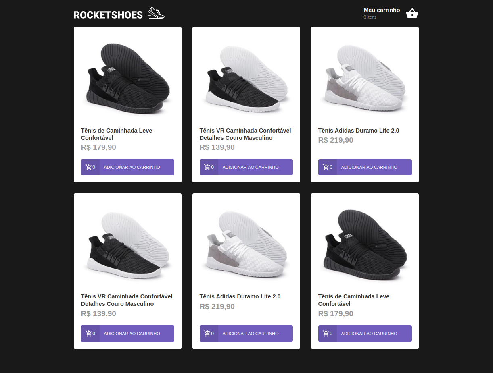

# <div align="center" style="margin-bottom: 50px">Rocketshoes 👟</div>

####



<p align="center">A minimalist shoe store application based on Netshoes 👟</p>

## 🛠️ Technologies

<ul>
  <li><a href="https://nodejs.org/en/">Node.js</a></li>
  <li><a href="https://expressjs.com/">Express</a></li>
  <li><a href="https://reactjs.org/">React</a></li>
  <li><a href="https://redux.js.org/">Redux</a></li>
  <li><a href="https://redux-saga.js.org/">Redux Saga</a></li>
  <li><a href="https://github.com/immerjs/immer">Immer.js</a></li>
  <li><a href="https://www.npmjs.com/package/json-server">JSON Server</a></li>
</ul>

## ⚙️ Requirements

<ul>
  <li><a href="https://nodejs.org/en/">Node.js</a></li>
  <li><a href="https://www.npmjs.com/">NPM</a></li>
</ul>

## 🚀 Installation

```bash
$ git clone https://github.com/gabrielsanttana/rocketshoes
```

### 🗄️ API

```bash
$ cd rocketshoes
$ npm install
$ npm run server
```

JSON Server will simulate a RESTful API and serve on http://localhost:3333

> Note: It's necessary to have the API running to be able to properly run the web app

### 💻 Web

```bash
$ cd rocketshoes
$ npm install
$ npm start
```

The application will pop-up in the browser on http://localhost:3000

## ⚖️ License

[MIT License](https://github.com/gabrielsanttana/rocketshoes/blob/master/LICENSE)
